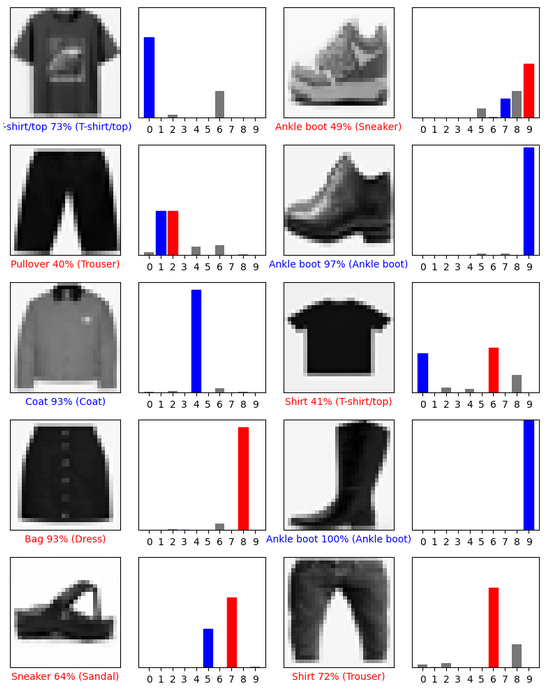

# 1
## 1.1 Expliquez les points communs et différences entre Keras, Tensorflow, pytorch et Yolo Darknet
| Outil| Description|Mot clé|Point Commun| Différence|
|------|------------|-------|------------|-----------|
| Keras| Bibliothèque d'apprentissage profond à haut niveau qui permet d'interagir avec les algorithmes de réseaux de neurones profonds et d'apprentissage automatique|Simple - Flexible - Powerful - Interaction - Ergonomie - Modularité| Intégré à TensorFlow| Interface haut niveau|
| TensorFlow| Bibliothèque open source d'apprentissage automatique développée par Google|Open source - Interface - MainStream - Machine learning - Static| Backend intégré pour Keras, agit au même niveau que PyTorch| Utilise un graphique statique, différent de PyTorch|
| PyTorch| Bibliothèque open source python d'apprentissage automatique développée par Meta qui s'appuie sur Torch|Machine learning - Deep learning - Tensor - Numpy - Gradient| Agit au même niveau que TensorFlow | Utilise un graphique dynamique, différent de TensorFlow|
| YOLO Darknet | Framework pour la détection d'objets en temps réel sur des images|Détection object - Traitement image - Marginal - Easy to set up| - | Spécialisé dans la détection d'objets. Un réseau de neuronne pour une image entière|

## 1.2 On explicitera en particulier, ce qui est « statique » vs « dynamique »
- Graphique statique 
- - Structure prédéfinie, présente l'ensemble des opération que le modèle effectuera
- - Le modèle suit strictement la structure prédéfinie lors de son exécution
- - Par exemple TensorFlow, vous déclarez les opérations à l'avance, puis les exécutez dans une session TensorFlow. Ce graphique est fixe et ne change pas pendant l'exécution du modèle.
- Graphique dynamique
- - Flexible dans la construction du modèle. Opérations définies à mesure que le code est exécuté
- - Possibilité d'ajouter, modifier ou supprimer dynamiquement des opérations en fonction des besoin pendant l'exécution du code
- - Par exemple PyTorch, le graphe est construit dynamiquement à mesure que vous effectuez des opérations. Cela facilite le débogage, la recherche et la construction de modèles plus flexibles.

## 1.3 Le langage support utilisé
- Keras
- - API Python
- TensorFlow
- - Python 
- - C++
- - Java
- - ...
- PyTorch
- - Python 
- - API native Python
- YOLO Darknet
- - C 
- - CUDA (pour accéleration GPU)

Globalement Python est principalement utilisé mais beaucoup d'autres possibilité nativement ou en utilisant des franmewors, ou interfaces de binding

## 1.4 Comment est décrit le réseau de neurones  (donner des exemples)
Un réseaux est décrit selon ces spécifications : 
- Manière dont les neurones sont connectés
- Fonctions d'activation utilisées 
- Definition du comprtement du réseau
Exemples de description d'un réseau de neurones entrée de 100 neurones, deux couches cachées 64 neurones avec fonction ReLU, et sortie de 10 neurones avec fonction d'activation softmax.
- Keras (utilisation TensorFlow) en Python
```
from tensorflow.keras.models import Sequential
from tensorflow.keras.layers import Dense

model = Sequential()
model.add(Dense(64, activation='relu', input_dim=100))
model.add(Dense(64, activation='relu'))
model.add(Dense(10, activation='softmax'))
```
- TensorFlow (utilisation Keras) en Python
```
import tensorflow as tf

model = tf.keras.Sequential([
    tf.keras.layers.Dense(64, activation='relu', input_shape=(100,)),
    tf.keras.layers.Dense(64, activation='relu'),
    tf.keras.layers.Dense(10, activation='softmax')
])
```
- PyTorch en Python
```
import torch
import torch.nn as nn

class SimpleMLP(nn.Module):
    def __init__(self):
        super(SimpleMLP, self).__init()
        self.fc1 = nn.Linear(100, 64)
        self.fc2 = nn.Linear(64, 64)
        self.fc3 = nn.Linear(64, 10)

    def forward(self, x):
        x = nn.ReLU()(self.fc1(x))
        x = nn.ReLU()(self.fc2(x))
        x = self.fc3(x)
        return x

model = SimpleMLP()
```
- YOLO Darknet
```
[net]
batch=64
subdivisions=16
height=416
width=416
channels=3

[convolutional]
size=3
stride=1
pad=1
filters=64
activation=leaky
```
# 2
https://www.tensorflow.org/tutorials/keras/classification </br>
Test du code fournit sous google Collab
## 2.1 Donner la définition d’un neurone au sens informatique
Un neuronne est une unité dans un réseau de neuronne. Chaque neuronne est conçu pour simuler le comportement des neuronnes biologiques du cerveau humain. Il s'appuie en général sur des données d'entrée, leur appliquent un traitement pour générer une sortie. Chaque neuronne peut etre connecter a une autre neuronne ou une source extérieur pour former un réseau de neuronne.
- Entrée
- - Reception valeur d'entrée venant d'autre neuronne ou de source extérieur
- - Pondérés par des poids définissant leur importance.
- Traitement 
- - Somme des valeurs d'entré en prenant en compte leur poid
- - Soumission des sommes pondérée a une fonction d'activation non linéaire qui permet d'aprendre des relations complexes.
- Sortie
- - Résultat de la fonction d'activation a la somme pondéré. 
- - Transmise a d'autre neuronne ou couche suivante du réseau ou source extérieur.


## 2.2 En quoi consiste la notion de couche dans les réseaux de neurones 
- Un réseau de neuronne est consititué de plusieur couche.
- Chaque couche possède plusieur neuronne qui sont au même niveau. 
- Chaque neuronne d'une même couche est situé au meme niveau dans le réseau
- - Ils recoivent des données de la couche précédente 
- - Ils envoient leur données traitées a la couche suivante 
- - Les neuronne d'une même couche ne communiquent pas entre eux 

Il existe 3 type de couche 
- Input
- - Une seule couche par réseaux, c'est la première du réseau 
- - Les neuronne recoivent d'une source externe et envoient a la couche caché suivante 
- - Nombre de neuronne depend du cadre d'utilsation du réseau
- Cachées
- - Nombre potentiellement infini par réseaux, apres la couche d'input et avant cette d'output
- - A partir de 2 couches on peut parler de réseau profond => deep learning
- - Chaque couche peut potentiellement contenir une infinité de neuronne.
- - Chaque neuronne recoit de l'input ou d'une couche caché et renvoi a une couche caché ou l'output
- - Applciation d'un traitement dans le transit des données au sein de cette couche
- Output
- - Une seule couche par réseaux, c'est la dernière du réseau 
- - Les neuronne recoivent d'un neuronne chaché et envoient la source externe 
- - Nombre de neuronne depend du cadre d'utilsation du réseau


## 2.3 En quoi consiste une couche dans un réseau neurone
Réponse au dessus 

## 2.4 Quelles sont les différentes  couches généralement associés dans les réseaux de neurones (faire d’abord une  réponse rapide que vous compléterez jusqu au dernier TP au fur et à mesure ….)
Réponse au dessus

## 2.5 Expliquer en détail le réseau sous-jacent de l’exemple
```
model = tf.keras.Sequential([
    tf.keras.layers.Flatten(input_shape=(28, 28)),
    tf.keras.layers.Dense(128, activation='relu'),
    tf.keras.layers.Dense(10)
])
```
- Dans l'exemple on construit un réseaux de neuronne séquentiel constitué de 3 couches
- La première est de type `Flatten` 
- - Elle transforme le format des images d'un tableau bidimensionnel (de 28 par 28 pixels) en un tableau unidimensionnel (de 28 * 28 = 784 pixels). 
- - Cette couche permet de désempiler les rangées de pixels de l'image et de les aligner. Cette couche n'a pas de paramètres à apprendre ; elle ne fait que reformater les données.
- Une fois les pixels aplatis, nous avons deux couches de type `Dense` ce type a des paramètre appris pendant l'entrainement, la formation du réseau
- - La première couche Dense comporte 128 nœuds (ou neurones) avec une fonction d'activation `relu`
- - La deuxième (et dernière) couche renvoie un tableau de logits d'une longueur de 10. 
- - - Chaque nœud contient un score qui indique que l'image actuelle appartient à l'une des 10 classes.

## 2.6 Est ce habituel ? Pouvait on faire plus simple ?
Ca semble assez habituel. Je ne sais pas si on pouvait faire plus simple.  
Le format semble assez simple avec seulement une couche d'apprentissage.  
Il semble adaptéau problème en question :  couche d'applatissage des images, et couche de sortie qui renvoie les score par classe  
On a l'air d'enchainer des couches assez simple

## 2.7 Quel type de modifications simplistes peut être faite sur le réseau et en particulier  sur les hyper paramètres. 
Les hyperparamètres ne sont pas appris à partir des données, mais sont définis avant le processus d'entraînement.  
Ils contrôlent divers aspects de la formation et de l'architecture du réseau, influençant ainsi la manière dont le modèle apprend et généralise à partir des données.  
Les hyperparamètres sont essentiels pour ajuster et optimiser le modèle.
Ils sont renseigné au moment de la compilation du modèle 
```
model.compile(optimizer='adam',
              loss=tf.keras.losses.SparseCategoricalCrossentropy(from_logits=True),
              metrics=['accuracy'])
```
- Optimiseur
- - C'est la façon dont le modèle est mis à jour en fonction des données qu'il voit et de sa fonction de perte.
- Fonction de perte 
- - Elle mesure la précision du modèle pendant la formation. 
- - Vous souhaitez minimiser cette fonction pour "orienter" le modèle dans la bonne direction.
- Métriques
- - Utilisées pour surveiller les étapes de formation et de test. 
- - L'exemple suivant utilise la précision, c'est-à-dire la fraction des images correctement classées.

Dans notre cas, les hyper paramètre semblent complexe a changer, on pourrait deja simplement essayer de changer le modèle du réseau en changeant les couches.  
La couche d'entrée et de sortie etant contraintes par le cadre et le contexte on peut essayer de changer la couche du milieu en changeant la fonction d'activation ou le nombre de noeud, ou bien en rajoutant des couches de ce type.

## 2.8 Relancer l’apprentissage en changeant ses paramètres, mettre en place un tableau montrant l’influence de ses paramètres.
On fait varier le nombre de noeud au sein d'une couche ou le nombre de couche ou les deux. On part du principe que de base on a 1 couche de 128 noeud  
Voici toute les configuration testées avec leur résultat et influence
|couche|noeud par couche|loss|accuracy|influence par rapport a x1|influence par rapport a x2| 
|---------------|----------------|----|--------|---------|---|
|x1|x1|0.3363|0.8824999928474426| - | - |
|x2|x1|0.3316|0.8871999979019165|loss -- & accuracy ++| - |
|x1|x2|0.3391|0.8845999836921692|loss + & accuracy +| - |
|x2|x2|0.3339|0.8852999806404114|loss - & accuracy + | - |
|x1|x6|0.3366|0.8862000107765198| loss = & accuracy + |loss - & accuracy +|
|x6|x1|0.3489|0.8766000270843506| loss + & accuracy - |loss + & accuracy --|

Conclusion : il semble mieux de rajouter juste un peu de couche mais pas trop non plus sans ajouter de noeud dedans. Mais globalement l'influence est vrmt pas énorme
<details>
    <summary>Détail des test</summary>

    ```
    model = tf.keras.Sequential([
        tf.keras.layers.Flatten(input_shape=(28, 28)),
        tf.keras.layers.Dense(128, activation='relu'),
        tf.keras.layers.Dense(10)
    ])
    ```
    `313/313 - 1s - loss: 0.3363 - accuracy: 0.8825 - 555ms/epoch - 2ms/step`  
    `Test accuracy: 0.8824999928474426`  
      

    ```
    model = tf.keras.Sequential([
        tf.keras.layers.Flatten(input_shape=(28, 28)),
        tf.keras.layers.Dense(128, activation='relu'),
        tf.keras.layers.Dense(128, activation='relu'),
        tf.keras.layers.Dense(10)
    ])
    ```
    `313/313 - 1s - loss: 0.3316 - accuracy: 0.8872 - 635ms/epoch - 2ms/step`  
    `Test accuracy: 0.8871999979019165`  
      

    ```
    model = tf.keras.Sequential([
        tf.keras.layers.Flatten(input_shape=(28, 28)),
        tf.keras.layers.Dense(256, activation='relu'),
        tf.keras.layers.Dense(10)
    ])
    ```
    `313/313 - 1s - loss: 0.3391 - accuracy: 0.8846 - 667ms/epoch - 2ms/step`  
    `Test accuracy: 0.8845999836921692`  
      

    ```
    model = tf.keras.Sequential([
        tf.keras.layers.Flatten(input_shape=(28, 28)),
        tf.keras.layers.Dense(256, activation='relu'),
        tf.keras.layers.Dense(256, activation='relu'),
        tf.keras.layers.Dense(10)
    ])
    ```
    `313/313 - 1s - loss: 0.3339 - accuracy: 0.8853 - 1s/epoch - 3ms/step`  
    `Test accuracy: 0.8852999806404114`  
      

    ```
    model = tf.keras.Sequential([
        tf.keras.layers.Flatten(input_shape=(28, 28)),
        tf.keras.layers.Dense(128, activation='relu'),
        tf.keras.layers.Dense(128, activation='relu'),
        tf.keras.layers.Dense(128, activation='relu'),
        tf.keras.layers.Dense(128, activation='relu'),
        tf.keras.layers.Dense(128, activation='relu'),
        tf.keras.layers.Dense(128, activation='relu'),
        tf.keras.layers.Dense(10)
    ])
    ```
    `313/313 - 1s - loss: 0.3489 - accuracy: 0.8766 - 771ms/epoch - 2ms/step`  
    `Test accuracy: 0.8766000270843506`  
      

    ```
    model = tf.keras.Sequential([
        tf.keras.layers.Flatten(input_shape=(28, 28)),
        tf.keras.layers.Dense(768, activation='relu'),
        tf.keras.layers.Dense(10)
    ])
    ```
    `313/313 - 2s - loss: 0.3366 - accuracy: 0.8862 - 2s/epoch - 5ms/step`  
    `Test accuracy: 0.8862000107765198`  
</details>

## 2.9 Quelle est la fonction d’activation associée au modèle, tester avec d’autres fonctions d’activation. Quelles sont les performances obtenues.
C'est la focntion relu qui est définie dans la couche du milieu au moment de la construction des couches du modèle.
Liste des potentielles activations :  
  

Tests : 
|fonction d'activation|loss|accuracy|
|---------------------|----|--------|
|relu|0.3363|0.8824999928474426|
|elu|0.3405|0.8805000185966492|
|linear|0.4471|0.8445000052452087|
|mish|0.3378|0.886900007724762|
|exponential|0.4219|0.8657000064849854|
|softmax|0.4916|0.8321999907493591|

# 3 On veut tester 10 images que vous créerez vous même ne partant d’image couleur trouvés sur internet et en les convertissant pour les mettre au format reconnu par « ..._model.predict ».

## 3.1 Quelle est ce format ? On passera par un fichier bmp en 28x28 puis on rajoutera au dossier sous google collab et on convertira directement pour l’usage dans predict  (quel est le code associé sous  google collab)
On se base sur la variable test_image du notebook.  
Cette varialbe est tableau d'image, chaque image est une cellule de ce tableau  
Chaque image est elle même un tableau ou chacune de ces cellule est une ligne de pixel de l'image  
Chaque cellule de cette ligne de pixel est un pixel de la ligne dans l'ordre qui est une valeurs numérique en 0 et 1 qui représente le niveau de gris du pixel  

La variable test_images est créée par ces lignes dans le google collab 
```
fashion_mnist = tf.keras.datasets.fashion_mnist

(train_images, train_labels), (test_images, test_labels) = fashion_mnist.load_data()
```
Voici un exemple de sa shape `(10000, 28, 28)`

## 3.2 Deposer ces images sur le e-campus  sous un format bmp 28X28 et déposer aussi l’orginal trouvé sur internet . Est ce fait ?
Oui, voici le code permettant de transformer mes vraies images, les traiter, les mettre dans un table au même formet et recuperer les images traiter au format bmp dans un dossier de mon drive 
```python
from PIL import Image
import numpy as np
import os
from google.colab import drive

# Montez votre Google Drive pour enregistrer les images traitées
drive.mount('/content/drive')

# Spécifiez le répertoire où se trouvent vos images
image_directory = "./my_images"

# Répertoire de destination pour les images traitées
output_directory = "/content/drive/My Drive/Processed_Images/"
os.makedirs(output_directory, exist_ok=True)

# Liste de noms de fichiers de vos images
image_files = os.listdir(image_directory)

# Créez une liste pour stocker les tableaux de pixels de chaque image
images_data = []

# Parcourez chaque image
for image_file in image_files:
    if image_file.endswith(".jpg"):  # Assurez-vous que seuls les fichiers d'image sont traités
        img = Image.open(os.path.join(image_directory, image_file))
        img = img.convert("L")  # Convertir en nuances de gris
        img = img.resize((28, 28))  # Redimensionner en 28x28 pixels
        img_data = 255 - np.array(img)  # Inverser les valeurs en soustrayant chaque pixel de 255
        img_data = img_data / 255.0  # Normaliser les valeurs entre 0 et 1
        images_data.append(img_data)

        # Enregistrez l'image traitée en format BMP dans le répertoire de destination
        img_processed = Image.fromarray((img_data * 255).astype(np.uint8))
        img_processed.save(os.path.join(output_directory, image_file.replace(".jpg", ".bmp")))

# Convertir la liste d'images en un tableau 3D
images_data = np.array(images_data)

# Chaque image est maintenant accessible à partir de images_data[index]
# Par exemple, la première image serait images_data[0]

print("Images converties en nuances de gris, inversées, redimensionnées et stockées dans un tableau.")
print("Shape du tableau 3D : ", images_data.shape)
```
Toutes les images traités au format bmp se trouvent dans le dossier [my_images_processed](./my_images_processed/)

## 3.3 Tester vos images, on affichera l’image et le résultat sous google collab

### Code pour transformer mes vraies images 
Attention a bien inverser la couleur

```python
from PIL import Image
import numpy as np
import os

# Spécifiez le répertoire où se trouvent vos images
image_directory = "./my_images"

# Liste de noms de fichiers de vos images
image_files = os.listdir(image_directory)

# Créez une liste pour stocker les tableaux de pixels de chaque image
images_data = []

# Parcourez chaque image
for image_file in image_files:
    if image_file.endswith(".jpg"):  # Assurez-vous que seuls les fichiers d'image sont traités
        print(image_file)
        img = Image.open(os.path.join(image_directory, image_file))
        img = img.convert("L")  # Convertir en nuances de gris
        img = img.resize((28, 28))  # Redimensionner en 28x28 pixels
        img_data = 255 - np.array(img)  # Inverser les valeurs en soustrayant chaque pixel de 255
        img_data = img_data / 255.0  # Normaliser les valeurs entre 0 et 1
        images_data.append(img_data)

# Convertir la liste d'images en un tableau 3D
images_data = np.array(images_data)

# Chaque image est maintenant accessible à partir de images_data[index]
# Par exemple, la première image serait images_data[0]

print("Images converties en nuances de gris, redimensionnées et stockées dans un tableau.")
print("Shape du tableau 3D : ", images_data.shape)
# print(images_data)
```

### On met nos test_lables adéquat
`labels_data = [0, 7, 1, 9, 4, 0, 3, 9, 5, 1 ]`

### Construction prediction avec mes images
`predictions = probability_model.predict(images_data)` 

### Affichage de nos resultats
```python
# Plot the first X test images, their predicted labels, and the true labels.
# Color correct predictions in blue and incorrect predictions in red.
num_rows = 5
num_cols = 2
num_images = num_rows*num_cols
plt.figure(figsize=(2*2*num_cols, 2*num_rows))
for i in range(num_images):
  plt.subplot(num_rows, 2*num_cols, 2*i+1)
  plot_image(i, predictions[i], test_labels, images_data)
  plt.subplot(num_rows, 2*num_cols, 2*i+2)
  plot_value_array(i, predictions[i], test_labels)
plt.tight_layout()
plt.show()
```


# 4
## 4.1 Avez-vous des idées pour améliorer la structure du réseau ?
Se reporter aux résultat présentés dans la quesion 2 notamment la 2.8 et la 2.9.  
En soit je n'ai pas vraiment d'idée précise et dont je suis sur car aucun n'a donner de resultat avec de grosses marges d'améliorations 
On pourrait surtout (a mon sens) peut etre changer les hyper paramètre rensiegné lors de la compilation. J'en ai vu certain, qui pourrait etre plus cohérent entre eux. Notamment pour la fonction de perte et la métrique par exemple. Pour les optimizer c'est une peu plus flou, ils ontr l'air d'utiliser des algo précis. Certaines métrique et fonction de perte peuvent utiliser la meme technique parfois. Par exemple il existe une métrique `BinaryCrossentropy` et une fonction de perte `BinaryCrossentropy` 

## 4.2 Lesquels ? 
En soit il faudrait tester pleins d'autres combinaison de ces paramètres jusqu'a en trouver un avec une différence notoire  
Mais je pense prendre la combinaison des paramètre de fonction d'activation, nombre de noeud par couche et nombre de couche qui a donner les meilleur resultat dans mes resultat de la question 2.  
Donc, on va simplement doubler le nombre de couche, garder le meme nombre de noeud par couche et choisir la fonction d'activation `mish`.  
Ce qui va nous donner la configuration suivante : 
```python
    model = tf.keras.Sequential([
        tf.keras.layers.Flatten(input_shape=(28, 28)),
        tf.keras.layers.Dense(128, activation='mish'),
        tf.keras.layers.Dense(128, activation='mish'),
        tf.keras.layers.Dense(10)
    ])
```

## 4.3  Tester pour voir si c’est mieux et conclure ?
On obtient les résultat suivant avec les données de test initiales  
`313/313 - 1s - loss: 44.2892 - accuracy: 0.8734 - 901ms/epoch - 3ms/step`  
On obtient finalement le resultat suivant pour nos 10 images 
  
On voit que rien ne change. Les resultat d'accuracy et loss n'ont pas vraiment changé non plus donc c'est cohérent, il faudrait surement tester des choses plus impactanten, comme peut etre les hyper paramètre ou d'autre test dans le modèle de couches.


# Sources
- ChatGPT  
- https://pjreddie.com/darknet/yolo/  
- https://pytorch.org/ 
- https://www.tensorflow.org/?hl=fr 
- https://keras.io/about/ 
- https://www.geeksforgeeks.org/dynamic-vs-static-computational-graphs-pytorch-and-tensorflow/ 
- https://fr.wikipedia.org/wiki/R%C3%A9seau_de_neurones_artificiels 
- https://fr.blog.businessdecision.com/tutoriel-machine-learning-comprendre-ce-quest-un-reseau-de-neurones-et-en-creer-un/ 
- https://www.tensorflow.org/api_docs/python/tf/keras/optimizers 
- https://www.tensorflow.org/api_docs/python/tf/keras/losses
- https://www.tensorflow.org/api_docs/python/tf/keras/metrics