# 1
## 1.a Expliquer la différence entre la classification d’image, la détection d’image la segmentation d’images
- Classification image 
- - Attribution d'une etiquette à une image en fonction de son contenu selon une règle prédéfinie
- - On s'attend a n'avoir qu'un seul sujet a classifier dans l'image qu'on classifie 
-  Détection d'image
- - Attribution d'étiquette a une partie d'une imageau sein d'une image. 
- - Identification de la position et la nature de plusieurs sujet dans une image
- Segmentation d'image
- - Division d'une image en plusieurs régions de pixels pour les classifier 
- - L'image est divisé en plusieurs régions, tout les pixels de l'image sont attribué a une image de sorte a segmenter toute l'image en plusieurs régions d'identification  


## 1.b Quelles sont les grandes solutions de détection d’objets
On peut séparer les solution de détection d'objet en 2 grandes classes, les one-stage et les two-stage
- Deux étage
- - Proposent d'abord des régions approximatives pour les objets
- - Puis effectuent la classification d'objets et la régression des boîtes englobantes
- - Précision de détection élevée, mais plus lents
- Un étage
- - Prédisent directement les boîtes englobantes sans l'étape de proposition de régions
- - Plus rapides pour les applications en temps réel, mais moins performants pour les objets irréguliers ou de petite taille  

Grands exemples : 
- YOLO (1 étage)
- SSD (1 étage)
- RetinaNet (1 étage)
- R-CNN (2 étages)
- - Faster R-CNN (2 étages)
- - Mask R-CNN (2 étages)
- - Granulated R-CNN (2 étages)  

### On s'interessera plus particulièrement au SSD (single-shot detector)  
Il s'agit d'une approche a prise de vue unique (one-stage), permettant de détecter tous les objets dans une image en une seule passe.  
Le SSD divise l'image en une grille, où chaque cellule de la grille est responsable de détecter les objets dans sa région.  
On peut utiliser une grille 4x4 pour détecter des objets plus petits, une grille 2x2 pour des objets de taille moyenne, et une grille 1x1 pour des objets qui couvrent l'ensemble de l'image.

# 2 
On s’intéresse à l’exemple suivant  
https://colab.research.google.com/github/tensorflow/docs/blob/master/site/en/hub/tutorials/tf2_object_detection.ipynb

## 2.a Quelles sont les classes reconnues par le réseau ?
- person
- - On voit meme un squelette de la personne si assez de détail
- kite
- surfboard

## 2.b Quelle partie du code correspond au chargement du modèle de réseau.Quelles sont les modèles proposés
Sélection du modèle :  
```
#@title Model Selection { display-mode: "form", run: "auto" }
model_display_name = 'CenterNet HourGlass104 Keypoints 512x512' # @param ['CenterNet HourGlass104 512x512','CenterNet HourGlass104 Keypoints 512x512','CenterNet HourGlass104 1024x1024','CenterNet HourGlass104 Keypoints 1024x1024','CenterNet Resnet50 V1 FPN 512x512','CenterNet Resnet50 V1 FPN Keypoints 512x512','CenterNet Resnet101 V1 FPN 512x512','CenterNet Resnet50 V2 512x512','CenterNet Resnet50 V2 Keypoints 512x512','EfficientDet D0 512x512','EfficientDet D1 640x640','EfficientDet D2 768x768','EfficientDet D3 896x896','EfficientDet D4 1024x1024','EfficientDet D5 1280x1280','EfficientDet D6 1280x1280','EfficientDet D7 1536x1536','SSD MobileNet v2 320x320','SSD MobileNet V1 FPN 640x640','SSD MobileNet V2 FPNLite 320x320','SSD MobileNet V2 FPNLite 640x640','SSD ResNet50 V1 FPN 640x640 (RetinaNet50)','SSD ResNet50 V1 FPN 1024x1024 (RetinaNet50)','SSD ResNet101 V1 FPN 640x640 (RetinaNet101)','SSD ResNet101 V1 FPN 1024x1024 (RetinaNet101)','SSD ResNet152 V1 FPN 640x640 (RetinaNet152)','SSD ResNet152 V1 FPN 1024x1024 (RetinaNet152)','Faster R-CNN ResNet50 V1 640x640','Faster R-CNN ResNet50 V1 1024x1024','Faster R-CNN ResNet50 V1 800x1333','Faster R-CNN ResNet101 V1 640x640','Faster R-CNN ResNet101 V1 1024x1024','Faster R-CNN ResNet101 V1 800x1333','Faster R-CNN ResNet152 V1 640x640','Faster R-CNN ResNet152 V1 1024x1024','Faster R-CNN ResNet152 V1 800x1333','Faster R-CNN Inception ResNet V2 640x640','Faster R-CNN Inception ResNet V2 1024x1024','Mask R-CNN Inception ResNet V2 1024x1024']
model_handle = ALL_MODELS[model_display_name]

print('Selected model:'+ model_display_name)
print('Model Handle at TensorFlow Hub: {}'.format(model_handle))
```

Chargement du modèle (hub correspond a la librarie `tensorflow_hub`) : 
```
print('loading model...')
hub_model = hub.load(model_handle)
print('model loaded!')
```

On retrouve les modèles proposée dans le code de sélection du modèle. Ils sont dans le tableau de paramètre de la variable `model_display_name`  

## 2.c Quelles sont les structures des modèles de réseaux sous jacents ?
- CenterNet
- - HourGlass104 
- - - Keypoints
- - - - 512x512
- - - - 1024x1024
- - - 512x512
- - - 1024x1024
- - Resnet50 ou Resnet101
- - - V1 FPN ou V2 
- - - - Keypoints
- - - - - 512x512
- - - - 512x512
- EfficientDet
- - D0 ... D7
- - - 512x512 ... 1536x1536
- SSD
- - MobileNet
- - - V1 ou V2
- - - FPN ou FPNLite
- - - 320x320 ou 640x640
- - ResNet50 ou ResNet101 ou ResNet152
- - - V1 FPN 640x640 ou 1024x1024
- Faster R-CNN
- - ResNet50 ou ResNet101 ou ResNet152
- - - V1
- - - - 640x640 ou 1024x1024 ou 800x1333
- - Inception ResNet
- - - V2 640x640 ou 1024x1024
- Mask R-CNN Inception ResNet V2 1024x1024

## 2 .d Tester sur une douzaine d’images de votre choix (Essayer sur des images contenant le plus de classes possibles reconnus) et faites un tableau comparatif

<details>
    <summary>Détail des tests</summary>
    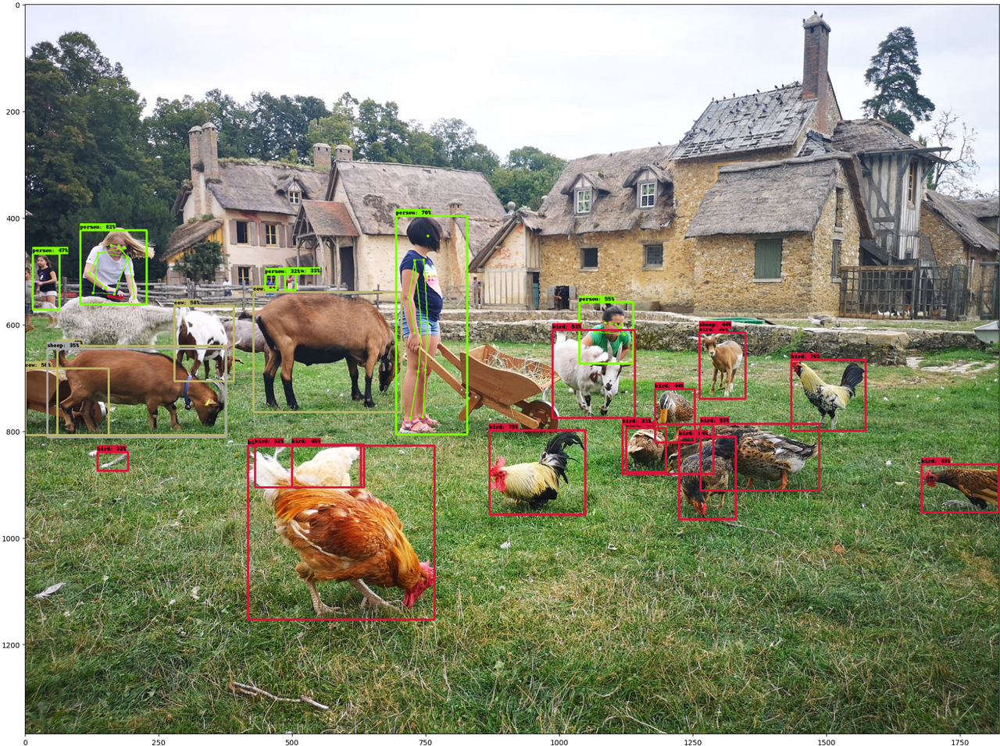
    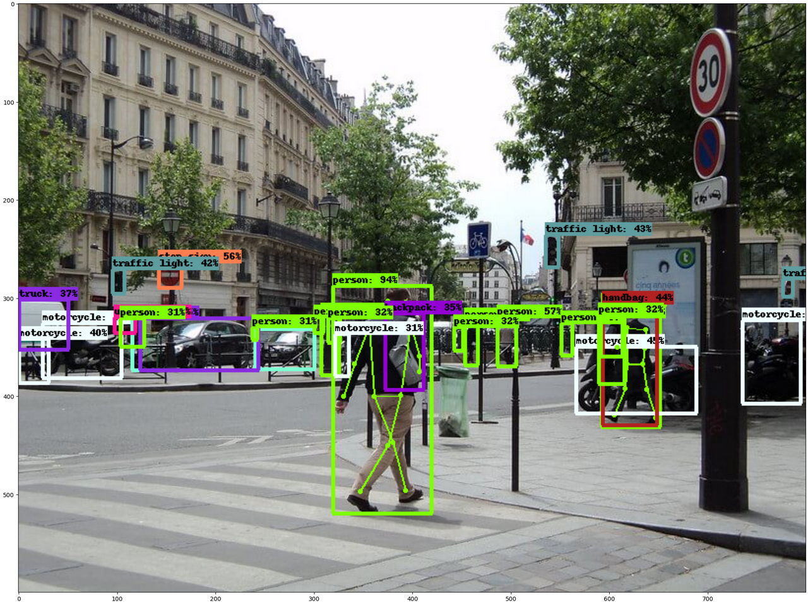
    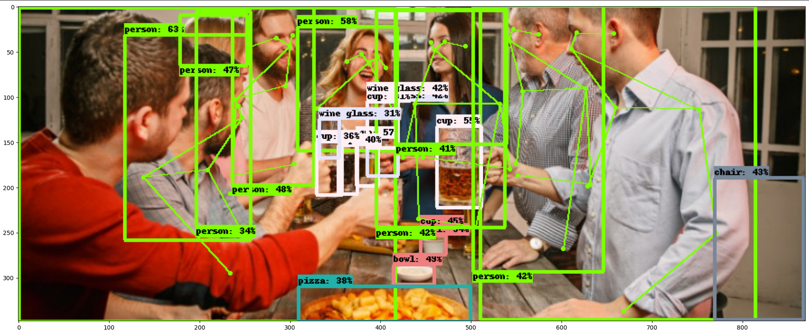
    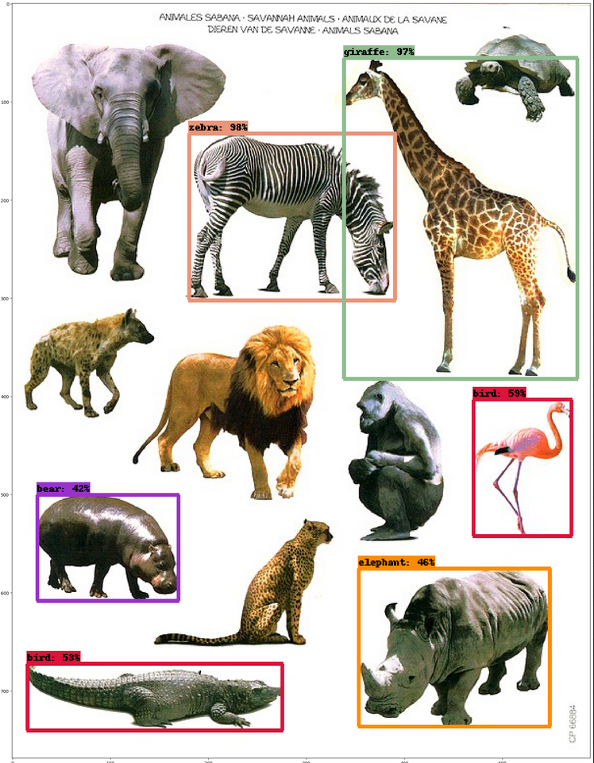
    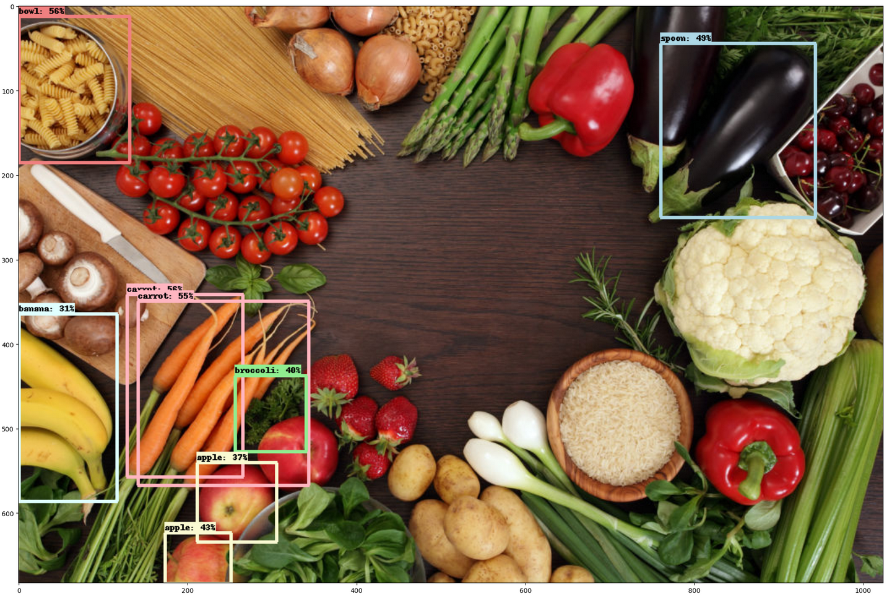
    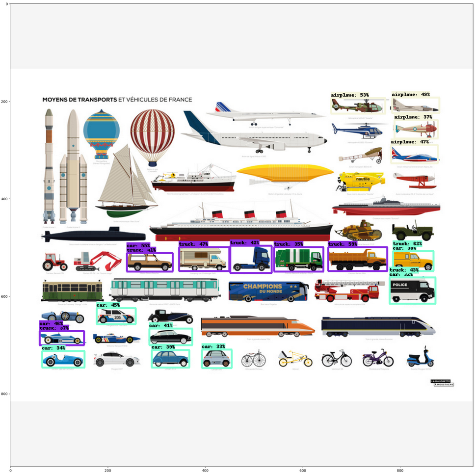
    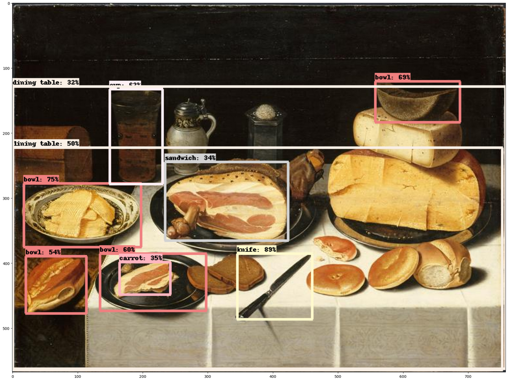
    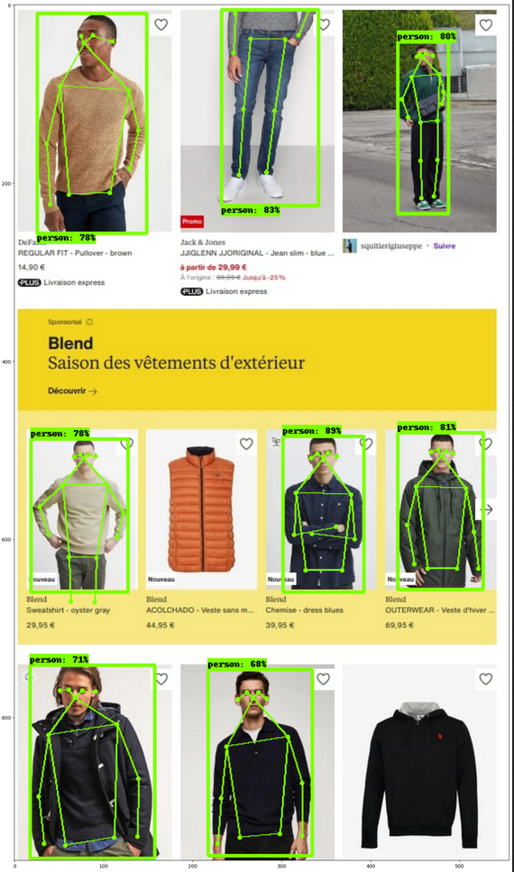
    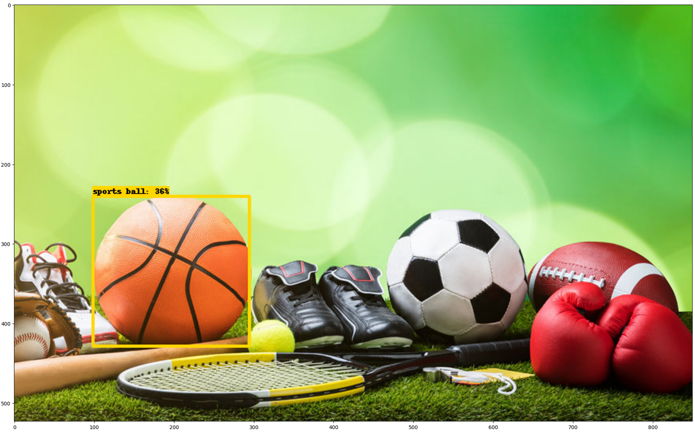
    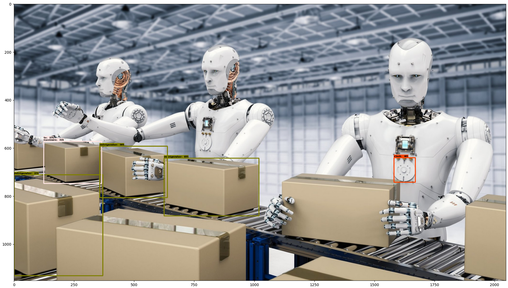
    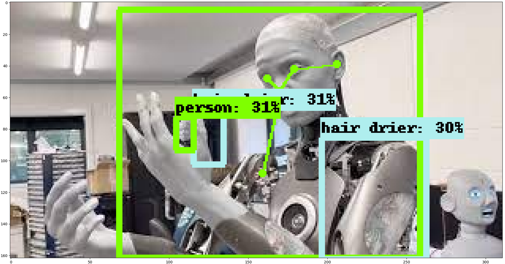
    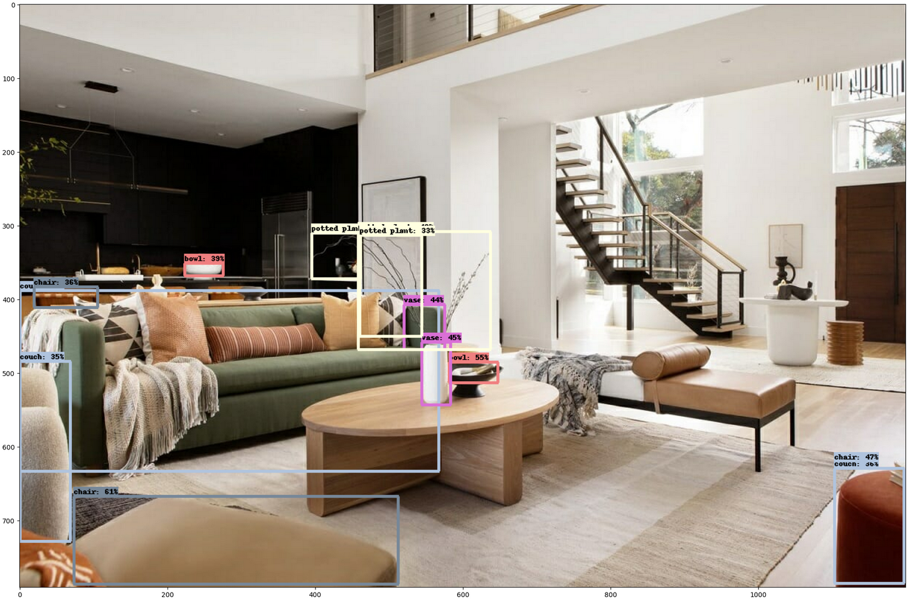
</details>

# 3
## 3.a A quoi sert Tensorflow Hub, et y a t il des solutions équivalentes ?

## 3.b Combien trouve t’on sur tensorflow hub de réseaux de detection d’objets ?

## 3.c Quelles sont les architectures de ces réseaux ?

## 3.d Quelles sont les classes reconnues ?

## 3.e Y a-t-il des exemples pour gérer une phase d’apprentissage ?


# Sources 
- ChatGPT
- https://intelligence-artificielle.com/classification-d-image-guide-complet/
- https://larevueia.fr/quest-ce-que-la-segmentation-dimages/
- https://www.augmentedstartups.com/blog/mastering-image-classification-techniques-enhancing-accuracy-and-efficiency
- https://viso.ai/deep-learning/object-detection/