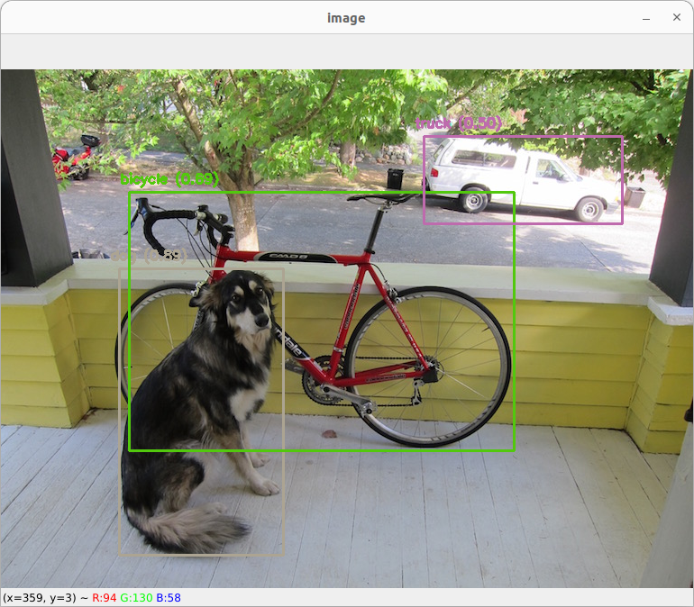
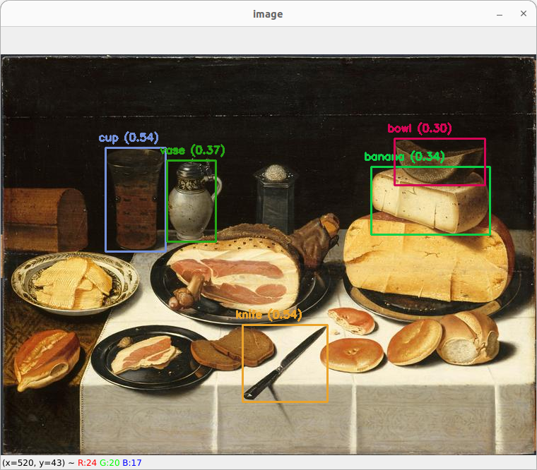

# Partie 1 Prise en main de yolo dans le module dnn d’opencv
## Question 1 .1 Quelles sont les classes reconnues par le réseau ? tester sur au 20 images par classes (conserver ces images et les déposer sur le ecampus). Tester les 2 réseaux yolo et tiny-yolo

On retrouve les classes dans le fichier `coco.names`

    
Liste des classes

    <pre>
        person 
        bicycle
        car
        motorbike
        aeroplane
        bus
        train
        truck
        boat
        traffic light
        fire hydrant
        stop sign
        parking meter
        bench
        bird
        cat
        dog
        horse
        sheep
        cow
        elephant
        bear
        zebra
        giraffe
        backpack
        umbrella
        handbag
        tie
        suitcase
        frisbee
        skis
        snowboard
        sports ball
        kite
        baseball bat
        baseball glove
        skateboard
        surfboard
        tennis racket
        bottle
        wine glass
        cup
        fork
        knife
        spoon
        bowl
        banana
        apple
        sandwich
        orange
        broccoli
        carrot
        hot dog
        pizza
        donut
        cake
        chair
        sofa
        pottedplant
        bed
        diningtable
        toilet
        tvmonitor
        laptop
        mouse
        remote
        keyboard
        cell phone
        microwave
        oven
        toaster
        sink
        refrigerator
        book
        clock
        vase
        scissors
        teddy bear
        hair drier
        toothbrush
    </pre>

    
Détail des images yolo

    
    
    
    
    
    
    
    
    
    
    
    
    
    

    
Détail des images tiny-yolo

    
    
    
    
    
    
    
    
    
    
    
    
    
    

## Question 1.2 A quoi sert le ou les thresholds ?

## Question 1.3 Quelles sont les fichiers utilisés liés au réseau de neurones  , que contiennent ils précisément ?

## Question 1.4 Quelle est l’architecture du réseau yolov3 et yolov3 tiny  , expliquer les différentes couches du réseaux .  Lesquelles dépendent du nombre de classes ?

## Question 1.5 Est-ce que vous trouvez d’autres modèles pré entrainés proposés aux téléchargement ? Si oui tester les 