## Question 1 
On s’intéresse au réseau suivant  
https://colab.research.google.com/github/timsainb/tensorflow2-generative-models/blob/master/2.0-GAN-fashion-mnist.ipynb 

## 1.a Mettre en œuvre le réseau.
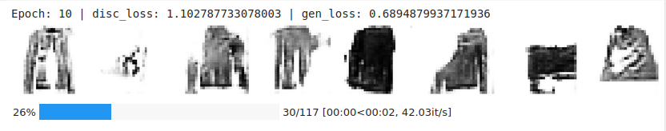
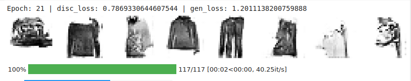
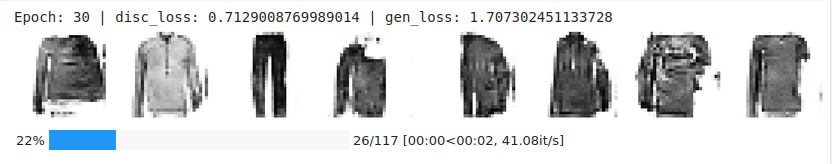

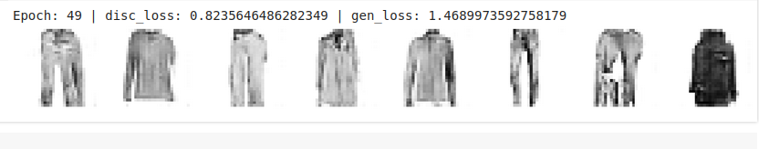

## 1.b Quelle est son objectif ?
Nous avons ici un réseau GAN (Generative Adversarial Network) dont le but est de générer des données réalistes semblable au dataset fourni sur lequel il s'est basé.  

## 1.c Que pensez vous du résulltats
Pour moi les resultats sont assez satifaisant. Nous avons des images générés qui sont environ semblable a celle données dans le dataset. malgré quelques imperfections : des images coupés, quelques formes incohérente... Nous parvenons facilement a reconnaitre nous meme que les donénes généré ressemblent a celles du dataset.

## 1.d Quelle est le nom d’une telle approche ? Expliciter le sens de l’architecture ?

Le GAN utilise un apprentissage non supervisé et adversarial.  

Non supervisé : 
- Pas besoin d'un ensemble de données étiqutées
- Apprentissage a partir de données brute    

Adversarial : 
- Deux agents en compétition le générateur et le discriminateur
- Générateur 
- - Produit des données a partir de bruit aléatoire au début
- - Puis va se baser sur les evaluations du discrimanteur par la suite 
- - Possède un réseau convolutif transposé activation relu et sigmoid
- Discriminateur
- - Prend en entrée à la fois des données du dataset et des données générées par le générateur 
- - Son but est de distinguer les données réelles des données du dataset
- - Possède un réseau convolutif activation relu

Un processus itératif pousse le générateur a apprendre est s'améliorer grace au discriminateur à chaque iterations.

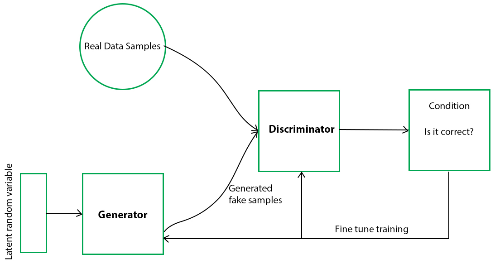

## 1.e  A quelle moment est utilisé le dataset.
Le dataset est utilisé par le discriminateur pour comparer les images du générateur aux images du dataset pour donner une évaluation aux images du générateur selon leur ressemblance a celles du dataset.  
Les images du générateur sont au début aléatoire puis s'appuient de plus en plus par celles précédemment généré que le discriminateur a le mieux évalué a partir du dataset. 

## 1.f Comment pourrait on mettre en œuvre un équivlent pour des visages ou des pizzas en utilisant la même architetcure
Il suffirait de donner un dataset approprié au modèle qui contiendrait des images de visages ou de pizzas. Ainsi le discrimnateur se baserait dessus et noterait au mieux les images ressemblante a des pizzas ou des visages

# Question 2 
Même question pour le code suivant  

https://colab.research.google.com/github/tensorflow/docs/blob/master/site/en/tutorials/generative/cvae.ipynb

## 1.a Mettre en œuvre le réseau.
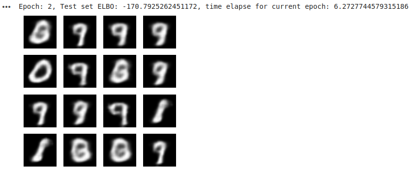

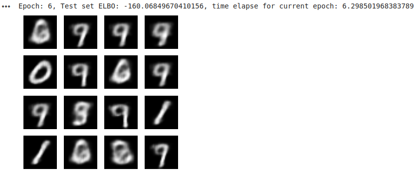
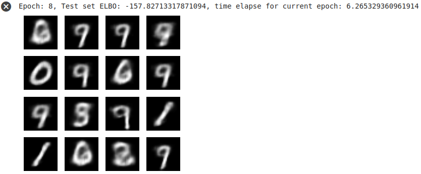
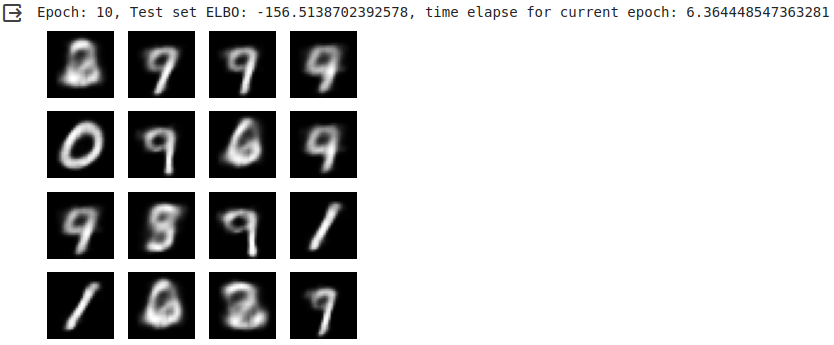

## 1.b Quelle est son objectif ?
Le CVAE (Conditional Variational Autoencoder) pour objectif de générer des données de manière conditionnelle spécifique, telle que des étiquettes, des attributs... Ici on s'interessera a la ressemblance à un dataset fourni.

## 1.c Que pensez vous du résulltats
Ils sont la aussi assez satifsaisant mais moins que le GAN à mon sens. nous avons quelques chiffre qui semblent etre une fusion de plusieurs chiffre, mais on voit bien que toute les images sont inspirés de formes de chiffre. Mais nous avons rapidement des dérives.  

De plus, celui ci ne semble pas forcémment apprendre aussi bien que le GAN au fil du temps. A chaque itération, les anomalies sont conservé et on ne voit presque aucune itération. Par contre les images sont précises et ressemblante des la première itération contrairement au GAN qui a besoin de plusieurs itérations.

## 1.d Quelle est le nom d’une telle approche ? Expliciter le sens de l’architecture ?

Le CVAE utilise une distribution latente et un controle de la génération.  

Distribution latente : 
- Il s'agit d'une représentation abstraite et encodé de l'image d'entré du dataset
- Cette transformation d'image d'entrée en distribution latente est assuré par l'encodeur
- Encodeur a des couches conv2D activation relu 

Controle de la génération : 
- Une fois l'image encodé et interprétable. Elle sera samplé afin de pouvoir servir de modèle pour la génération de sortie. 
- Lors de la génération, il est possible d'appliquer tout un de controle suivant plusieurs spécifications. 
- Il est possible de n'appliquer aucun controle et de généré simplement une image semblable a la distribution latente. 
- Le décodeur est responsable de ces taches
- Le décodeur a des couches conv2DTranspose activation relu
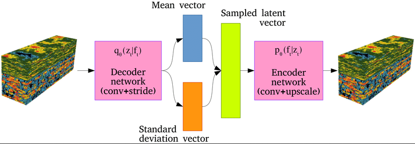

## 1.e changer le dataset Mnist digit par le MNIST fashion
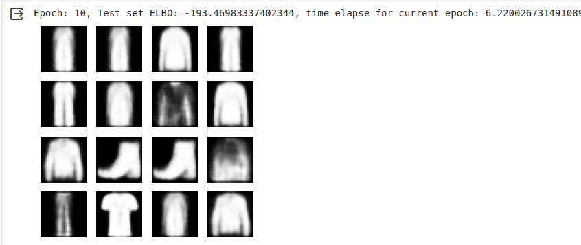  
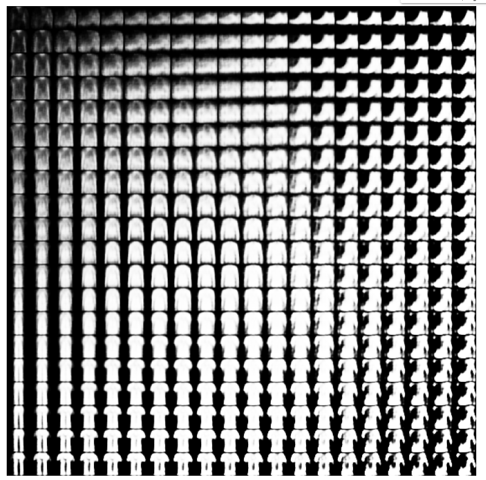 
Avec l'image du dessus on peut mieux se rendre compte que le CVAE serait surement mieux adapté pour ne généré des image semblable a un dataset qui contien seulement une classe.  
Nous avons ici l'impression que les images sont une espece de fusion de toutes les images de toute les classes. Nous pouvons voir une transformation de chaussure en pantalon en passant par le pull.  

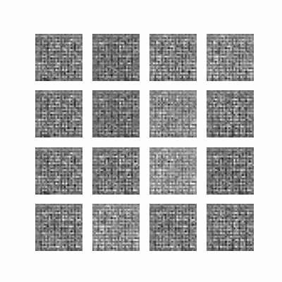  

## 1.e  A quel moment est utilisé le dataset.
Il est principalement utilisé dans la phase d'entrainement de l'encodeur afin que sa distribution latente soir la meilleure possible.  
Il est également utilisé lors du décodage qui se servivra du dataset lors de la generation conditionnelle.

## 1.f Comment pourrait-on mettre en œuvre un équivalent pour des visages ou des pizzas en utilisant la même architecture
De la même mainère que le GAN, il suffirait selon moi de changer le dataset. Nous avons pu voir que cela a fonctionner pour passer des chiffres aux vetements. En changeant le dataset, l'encodeur aurait une distribution latente qui serait une images abstraite de pizza ou de visage. La génération conditionnelle se baserait elle aussi sur les images de pizzas ou de visages.

## 1.e y  a-t-il une différence entre les deux approches
Oui, elles sont principalement décrites au dessus. 
Pour résumer le GAN génère des images aléatoire et se base sur la dataset pour evaluer la ressemblance avec les images aleatoirement generé pour tendre vers une ressemblance avec le dataset au fur et a mesure des iterations.   
Alors que le CVAE, va directement essayer de sortir une image abstraite se basant sur le dataset, il y appliquera ensuitedes conditions specifique lors de la génération. Les itéraitons n'ont aucun effet sur le CVAE.

## 1.f essayer d’utiliser le dataset pokemon disponible sur kaggle pour generer des pokemons

https://www.kaggle.com/code/lukemonington/pokemon-images-autoencoder-and-gan-in-tensorflow/notebook

Résultats avec un VAE sans couches convolutionnelles
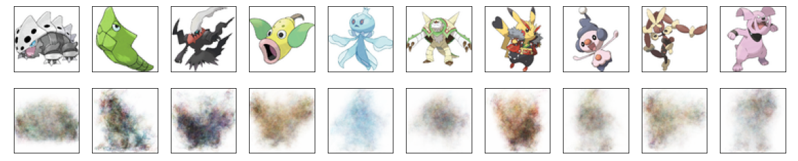  
Résultats avec un VAE avec couches convolutionnelles
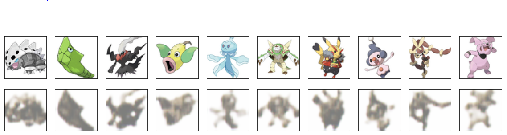  